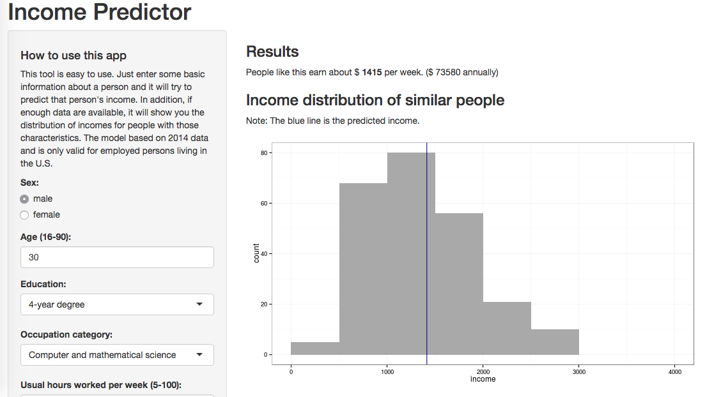

# Shiny app for income prediction

## About

This R/Shiny app uses a model based on Current Population Survey data to predict a person's income based on a handful of demographic and other characteristics.

I wrote it for the Coursera class "Developing Data Products".

## Usage

The app should be fairly self-contained and automatic. If it can't find a serialized model, it will re-create it (which takes a minute), and does some tricks to reduce the size of the serialized model from 100Mb to about 1Mb.

## The Data

The data is monthly data from CPS for the year 2014. I've pared it down to the following columns:

 * HRYEAR4
 * HRMONTH
 * PRERELG: earnings available flag
 * PRERNWA: weekly earnings (less overtime/commissions/tips)
 * PESEX: sex
 * PRTAGE: age
 * PEEDUCA: education level
 * PRDTOCC1: occupation category (23)
 * GTMETSTA: lives in metro/nonmetro area
 * PEHRUSL1: usual hours worked, main job
 * PEHRUSL2: usual hours worked, other jobs

In addition, I filtered the data by PRERELG == 1 (earnings available). I didn't include the code to wrangle the ultra-raw fixed-width-format CPS data in the repo but it was a fairly straightforward combination of `in2csv`, `csvstack`, `csvcut`, an `csvgrep`.

All other data filtering is included in the R code in `buildModel.R`.

## The Model

Initially I tried a random forest (regression) model; however, the RMSE was rather poor. I tried a few more models and ended up with a better RMSE with the bonus of better interpretability using a "bayesglm" model, which surprisingly was able to handle the categorical and ordinal features without preprocessing or creating dummy variables.

The RMSE with the Bayes GLM is still worse than I would like, but looking at the spread of the data for individuals who share basically the same characteristics, I don't think I'll be able to improve much on this model without adding more predictors. In particular, using more detailed occupation categories would likely lower the error -- there is still a wide array of job descriptions inside the 20 or so occupation categories used for this iteration. However, the CPS occupation categories jump from about 20 to hundreds, so that may not be feasible.
